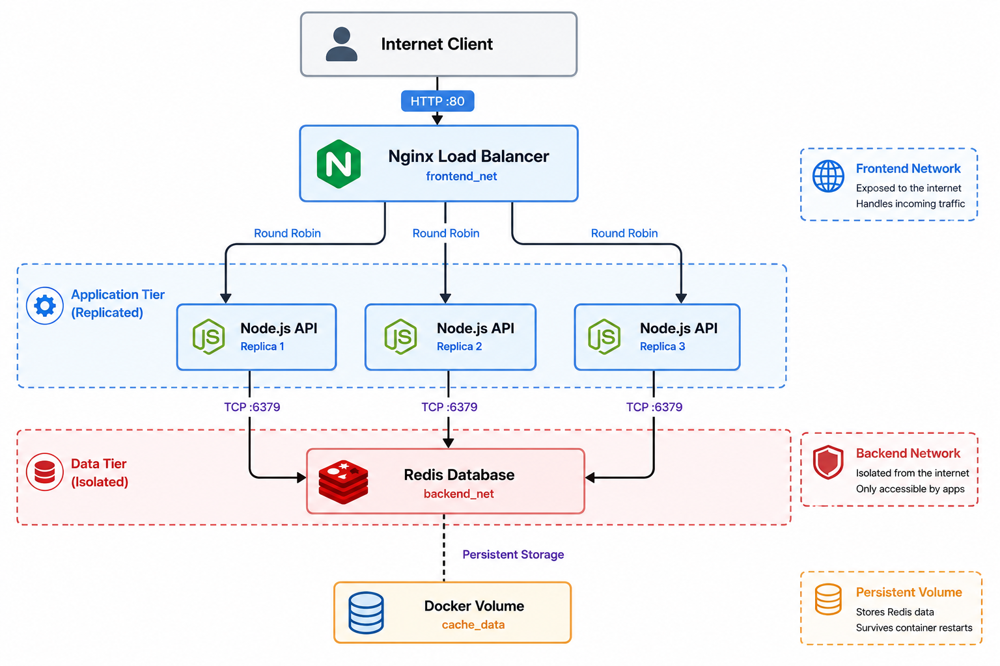
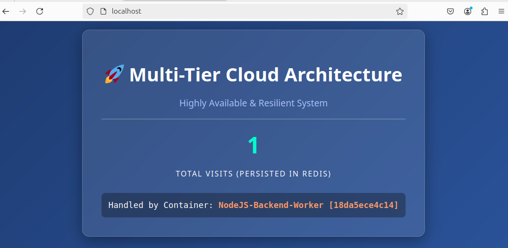
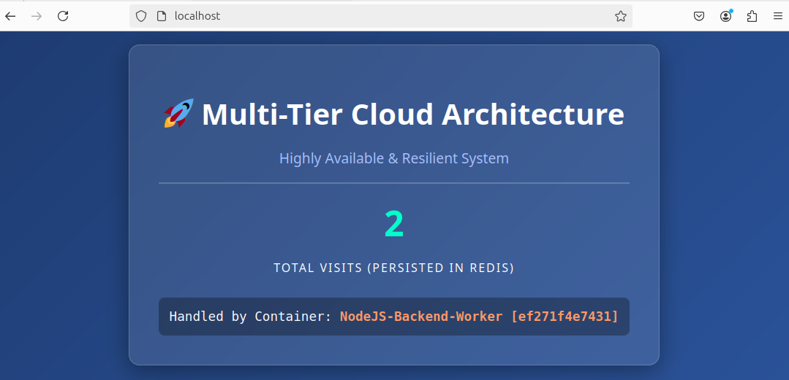
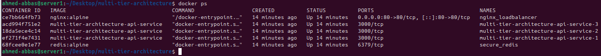
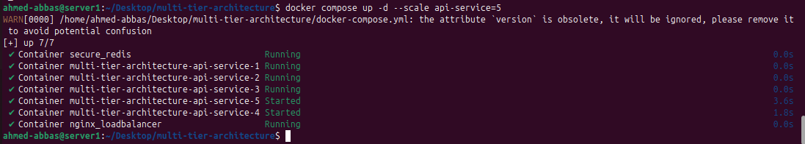
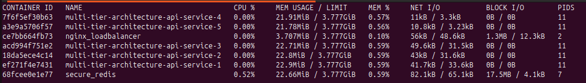

# 🌐 Multi-Tier Resilient Architecture & Load Balancing


## 📌 Project Overview
A highly available, production-grade 3-tier architecture built with Docker Compose. This project demonstrates advanced container orchestration concepts, including **Network Isolation**, **Dynamic Load Balancing**, **Container Replication**, and **Data Persistence**.

## 📂 Repository Structure

```text
.
├── app/                    # Backend Application Tier
│   ├── Dockerfile          # Multi-stage & secure build instructions
│   ├── server.js           # Express API logic & Redis integration
│   ├── package.json        # Node.js dependencies
│   └── .dockerignore       # Build context optimization
├── nginx/                  # Load Balancer Tier
│   └── nginx.conf          # Reverse proxy & round-robin configuration
├── assets/                 # Project showcase & documentation images
│   ├── visit-1.png         
│   ├── visit-2.png         
│   ├── docker-ps.png       
│   ├── scaling.png
│   ├── docker-stats.png       
│   └── project-diagram.png
├── docker-compose.yml      # The Maestro: Orchestrates services, networks, and volumes
└── README.md               # Comprehensive project documentation

```

## 🏗️ System Architecture

This project strictly adheres to security and network isolation best practices. The database is completely shielded from public networks.

<p align="center">
  
  <br>
  <em><b>Figure 1:</b> System Architecture Diagram </em>
</p>


## 📸 Project Showcase (Proof of Concept)

### 1. Load Balancing & State Persistence
The following demonstration proves that **Nginx** successfully routes traffic across different backend replicas (changing Container IDs) while **Redis** maintains the application state (incrementing visits) via Docker Volumes.

<p align="center">
  
  
</p>

### 2. Infrastructure Status & Network Isolation
Executing `docker compose ps` reveals the underlying architecture. Notice that only the Nginx Load Balancer exposes port `80` to the host, while the Node.js APIs and Redis database remain completely isolated within internal Docker networks.

<p align="center">
  
</p>

### 3. Elasticity & Zero-Downtime Scaling
The architecture allows horizontal scaling on the fly. By running a single command, the backend API is instantly scaled to 5 replicas without dropping any active connections.

<p align="center">
  
</p>

### 4. Real-Time Resource Monitoring
Utilizing `docker stats` to ensure the multi-tier application consumes optimal CPU and Memory resources efficiently across all running containers.

<p align="center">
  
</p>

## 💡 Key Features & Technical Decisions

- **Strict Network Isolation:** Designed with two custom bridge networks (`frontend_net` & `backend_net`). Nginx cannot communicate with Redis directly, drastically reducing the attack surface.
- **Dynamic Load Balancing:** Nginx acts as a Reverse Proxy, utilizing Docker's internal DNS to dynamically balance traffic across 3 Node.js API replicas using the Round-Robin algorithm.
- **High Availability & Scalability:** The backend API can be scaled horizontally on the fly without system downtime using Docker Compose's `deploy: replicas` feature.
- **Data Persistence:** Redis data is permanently stored on the host machine using Docker Volumes (`cache_data`), ensuring state persists across container restarts or deletions.
- **Optimized & Secure Images:** The Node.js application utilizes Multi-Stage Builds and runs entirely as a Non-Root user (`appuser`).

## 🚀 Getting Started

1. Build and Deploy the Architecture
```bash
docker compose up -d --build
```

2. Verify Load Balancing & Persistence

Navigate to http://localhost in your browser.
Refresh the page multiple times to observe:

* Incrementing Visits: Proves Redis is successfully persisting state.
* Changing Container IDs: Proves Nginx is actively load balancing requests across the 3 backend replicas.

3. Scale on the Fly (Zero Downtime)

Scale the backend API to 5 instances instantly:
```bash
docker compose up -d --scale api-service=5
```
🧹 Cleanup

To tear down the architecture while preserving the persistent database volume:
docker compose down
To destroy everything, including the persistent data:
```bash
docker compose down -v
```

**Architected by:** Ahmed Mohamed Abbas Bahij

[](https://www.linkedin.com/in/ahmedabbas99)

Cloud Infrastructure & DevOps Engineer
